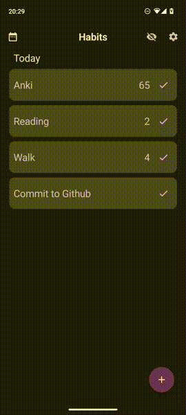
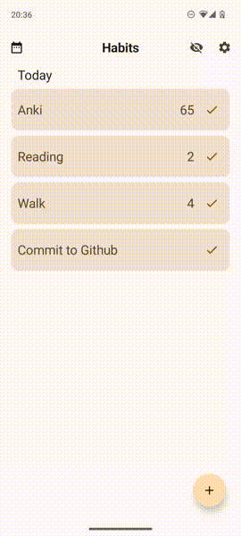
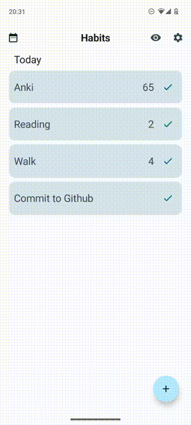

# Habit Tracker App

## Screenshots

## Features

- **Build habits that last** - Easily complete habits from the today view whenever they are due.
- **Insightful habit analysis** - Habits provides a score for each habit, helping you track progress towards your goals.
- **Track weekly or daily habits** - Whether it's running twice a week or playing the piano on Thursdays, Habits helps you monitor your habits.
- **Comprehensive overview** - Visualize your habit history over past months in the logbook view.
- **Sleek animations** - Utilizing cutting-edge Android technologies, Habits offers beautifully animated actions for a satisfying habit-completion experience.
- **Material Design and color theming** - Aligned with the latest [Material Design guidelines](https://m3.material.io/), Habits supports dynamic color theming by default.
- **Ad-free and open source** - Habits is completely free with no in-app purchases or subscriptions.
- **Offline and privacy-focused** - Operate Habits entirely offline; your data remains solely on your device and is never shared with anyone.